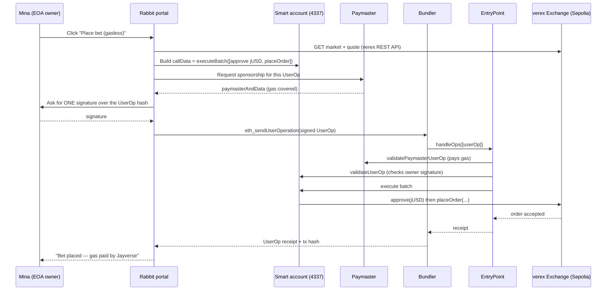

# Jayverse — Account Abstraction (ERC-4337)

**Purpose:** give a Jayverse user a smart account so common cross-service actions —
starting with a bet on a verex market — become **gasless, one-click, and atomic**,
without ever holding Sepolia ETH or signing twice.

*Design draft for review — not built. Source: [09-02-jayverse.md §1 "Rabbit as Portal"](../tasks/09-02-jayverse.md)
(jay's comment: "We start with AA which is ERC 4337. Show me the user scenario … the flow …
It would be great to cooperate with my existing services."). Builds on the shipped
[/live/aa](../../app/live/aa/page.tsx) blocks and [agentic-aa.md](agentic-aa.md). Hub:
[README.md](README.md).*

---

## Phases (build order)

| Phase | Focus | What we implement |
|---|---|---|
| **1 (MVP)** | Gasless one-click bet | thirdweb ERC-4337 smart account + `sponsorGas` paymaster; `app/markets/` grid + Bet drawer; `lib/aa-bet.ts` batches `approve + placeOrder` into **one sponsored UserOp** against a real verex market; surfaces UserOp hash + receipt. Reuses `/live/aa`. |
| **2** | Local ↔ Sepolia bundler switch | `lib/aa-bundler.ts` environment selector; `scripts/aa-self-relay.mjs` (call `EntryPoint.handleOps` on anvil); thirdweb bundler on Sepolia. Keyed by explicit `AA_MODE`, not chainId. |
| **3** | Identity & UX breadth | one shared smart-account address across services; ERC-20 gas payment; recovery / social-login owner — handed to `jayverse-wallet`. |

---

## 1. What we build (the basic feature)

One buildable slice, nothing more:

- **A Jayverse smart account.** On first use, Rabbit deploys an ERC-4337 smart account
  (a counterfactual address that materializes on the first UserOperation) whose *owner*
  is the user's existing EOA (MetaMask / embedded wallet). The EOA signs; the smart
  account acts.
- **Gasless one-click bet.** From a verex market card inside the portal, the user clicks
  **Bet 5 jUSD on YES** once. A **paymaster** sponsors gas, so the user needs zero ETH.
- **Batched approve + trade in one signature.** The `approve(jUSD → verex exchange)` and
  the `placeOrder(...)` calls are packed into a **single UserOperation** (`executeBatch`).
  One signature, one atomic result — either both land or neither does.

Explicitly out of scope for v1: an autonomous decision loop (that is the
[mandate console](../../app/live/agent/console/page.tsx), see §6), ERC-20 gas payment
(we sponsor first), cross-chain, and account recovery/social login.

---

## 2. User scenario

**Mina** has used Rabbit before and has MetaMask connected, but her wallet holds only a
little test jUSD and **no Sepolia ETH**.

1. Mina opens the **Markets** tab in the Rabbit portal and sees a live verex market:
   *"Will Jayverse ship the DeFi service before Oct?"* — YES 0.62 / NO 0.38.
2. She clicks **Bet** on YES, types `5` jUSD, clicks **Place bet**.
3. Rabbit tells her she has no smart account yet and shows **Enable one-click betting**.
   She clicks it and approves **one** MetaMask signature — no ETH, no gas prompt.
4. A spinner: *"Sponsoring gas… submitting your order."* Behind the glass, her smart
   account is deployed, jUSD is approved, and the order is placed — all in one bundle.
5. Seconds later: **"Bet placed — 5 jUSD on YES @ 0.62. Gas paid by Jayverse."** with a
   link to the UserOperation and the resulting on-chain tx.
6. Her next bet skips step 3 entirely: the account already exists, so it is one click →
   one signature → done.

She never bought ETH, never issued a separate approval, never left the portal.

---

## 3. What the web app shows (screen by screen)

**Portal → Markets (`/markets`, new)**
- A grid of verex market cards (title, YES/NO prices, volume), pulled from the verex REST
  API. Each card has a **Bet** button and a small **⛽ gasless** badge.
- Top-right wallet chip: shows the EOA when only connected, and swaps to a **smart-account
  address + "Smart account" tag** once enabled.

**Bet drawer (opens over the card)**
- Outcome toggle (YES / NO), amount input, live cost/price, and the primary button whose
  label reflects state:
  - not connected → **Connect wallet**
  - connected, no smart account → **Enable one-click betting**
  - ready → **Place bet (gasless)**
- A one-line footer: *"Gas sponsored by Jayverse · approve + trade in one signature."*

**States inside the drawer**
- `deploying` — "Setting up your smart account…"
- `signing` — MetaMask popup ("Sign to authorize this batch")
- `bundling` — "Sponsoring gas & submitting…" with a UserOp hash once available
- `success` — filled amount, price, **View UserOp** / **View tx** links, **Bet again**
- `error` — decoded reason (e.g. *insufficient jUSD*, *market closed*) + Retry; the batch
  is atomic, so a failure means nothing was spent.

**Account page (`/live/aa`, existing — extended)**
- Reuse the current blocks to *explain* what just happened: the smart-account address, the
  paymaster used, and the last batched UserOp, linking each pillar (gas independence,
  atomic batch) to the real bet Mina just made.

---

## 4. The flow (technical)

EOA is the signer/owner; the **smart account** is the actor; a **bundler** relays and a
**paymaster** pays.

Key points:
- **One UserOperation, two calls.** `callData = executeBatch([approve, placeOrder])`.
  Atomicity is free — the EntryPoint reverts the whole op if any inner call fails.
- **Counterfactual deploy.** The account's `initCode` is included on the *first* UserOp
  only; the address is deterministic, so verex can be shown the address before deploy.
- **Signature, not transaction.** The user signs the UserOp hash off-chain; the bundler,
  not the user, submits the on-chain transaction — hence no ETH needed on the EOA either.
- **verex touchpoint.** Rabbit reads markets/quotes from the verex REST API and encodes the
  exchange's `placeOrder` (or CLOB fill) call as the second batch item; settlement is jUSD
  on Sepolia, verex's existing collateral unit.

---

## 5. How it cooperates with existing services

**verex (prediction market) — the payoff.** verex already runs a CLOB on Sepolia with a
REST API serving markets/orders. Rabbit consumes that API for display and quoting, and the
smart account calls verex's on-chain exchange inside the batch. verex needs **no change**
for v1 beyond confirming its `approve`/`placeOrder` ABI; the smart-account address is just
another trader to it. This is the concrete "gasless one-click bet" from verex §2 step 1,
driven from the portal side. (Later, verex's planned `verex-mcp` lets the *agent* place the
same order — same contract path, different caller.)

**/live/aa building blocks — reuse, don't rebuild.** The pillars page already runs a
thirdweb ERC-4337 smart account with **`sponsorGas` (paymaster)** and
**`sendBatchTransaction`** on Sepolia ([AgenticPillars.tsx](../../app/live/aa/AgenticPillars.tsx)),
plus the `THIRDWEB_CLIENT_ID` wiring and `lib/thirdweb-client.ts`. v1 is essentially those
two demonstrated capabilities pointed at a *real* verex call instead of a no-op. The
`/live/aa` page becomes the "how it works" explainer behind the Markets feature.

**Mandate console — a deliberate contrast, not a dependency.** The
[agent console](../../app/live/agent/console/page.tsx) uses **ERC-7715/7710 mandates**:
the user *pre-delegates* a bounded permission (cap + expiry) to a session key, and an
**autonomous agent** later spends within it, unattended, enforced by on-chain contracts.
AA v1 is the opposite control flow — **the human is in the driver's seat**, pressing the
button each time, and 4337's **paymaster** solves *gas*, not *authority*.

| | 4337 paymaster (this doc) | 7715/7710 mandate (console) |
|---|---|---|
| Who decides each action | the human, per click | the agent, within a pre-granted scope |
| What it removes | the gas requirement | the per-action signature prompt |
| Trust granted up front | none beyond one signature | a capped, time-boxed spend mandate |
| Failure bound | atomic revert of the batch | on-chain cap + expiry enforcement |

They compose later: an agent holding a 7715 mandate can *also* route its trades through a
4337 account so its mandated bets are gasless and atomic.

---

## 6. Implementation sketch

**Reused (already in the repo)**
- thirdweb Connect + Account (ERC-4337 smart account), `sponsorGas` paymaster, and
  `sendBatchTransaction` — proven on `/live/aa`.
- `lib/thirdweb-client.ts`, `THIRDWEB_CLIENT_ID`, Sepolia config, the wallet-connect UI.
- verex REST client pattern (the agent console already talks to `VEREX_API_URL`).

**New**
- `app/markets/` — the Markets grid + Bet drawer (portal-facing route).
- `lib/verex.ts` — thin typed client over the verex market/order API (list, quote, encode
  `placeOrder` calldata). Shared with the console's existing usage if possible.
- `lib/aa-bet.ts` — build `executeBatch([approve, placeOrder])`, request sponsorship, send
  the UserOp, surface UserOp hash + receipt.
- Env: `NEXT_PUBLIC_VEREX_URL` / `VEREX_API_URL` (exists), verex exchange + jUSD addresses
  from the shared `jayverse-rails` address book, `THIRDWEB_CLIENT_ID` (exists).

**Stack choice**
- **Default: thirdweb 4337** — it is already wired, so v1 is incremental. Bundler +
  paymaster are thirdweb-managed; least new plumbing.
- **Alternative: permissionless.js + Pimlico (viem-native)** — more transparent/portable
  and matches verex §2's own wording; heavier to stand up. Prefer thirdweb for v1, revisit
  if we want provider-independent 4337 across Jayverse (a `jayverse-wallet` concern).

**Open questions**
1. **Paymaster budget & abuse.** Sponsoring gas is a spend surface — per-user rate limit,
   per-day cap, allowlist to the verex exchange only. Where is the policy enforced (thirdweb
   dashboard vs our own paymaster)?
2. **Address identity across services.** Should a user's Jayverse smart-account address be
   *the* identity verex/personas/bridge all recognize (one account, many services), or per-
   service? Leans toward one shared account — a `jayverse-wallet` decision.
3. **verex ABI shape.** Is a single `placeOrder` on-chain call enough, or does the CLOB fill
   path need a signed order relayed to verex's API first (hybrid off-chain order / on-chain
   settle)? Determines what actually goes in the batch.
4. **Approval strategy.** Batch a fresh exact `approve` each time (safe, atomic) vs a one-
   time larger allowance (fewer ops, wider blast radius). v1: exact approve in the batch.
5. **Owner key model.** MetaMask EOA owner for v1; embedded/social-login owner and recovery
   are deferred to `jayverse-wallet`.

**Estimate:** ~2–3 focused days on top of `/live/aa` for the happy path (Markets grid, Bet
drawer, batched sponsored UserOp against a real verex market), plus paymaster-policy and
error-decoding hardening.

---

## 7. Local anvil vs Sepolia — the bundler switch (self-relay local)

**Decision (jay, 2026-09-07): don't implement a bundler — self-relay locally, thirdweb in the
cloud, behind one environment switch.**

The bundler is not a Jayverse service (see [README.md](README.md)). It is a
hosted relay that submits `EntryPoint.handleOps` on a public chain. That works for Sepolia, but
**not for a local anvil fork**: anvil reports Sepolia's chainId (`11155111`), so thirdweb's
chainId-keyed bundler would route to the *real* Sepolia, never to `127.0.0.1:8545`. Local tests
therefore need a different bundler path — and we do **not** write one.

| | Local (anvil) — **self-relay** | Sepolia (deployed) |
|---|---|---|
| Bundler | none — a script calls `EntryPoint.handleOps([userOp], beneficiary)` from a funded anvil account (**we are the bundler for that one call**) | thirdweb (hosted) |
| Paymaster | skip — pre-fund the smart account with anvil ETH | thirdweb `sponsorGas` |
| EntryPoint | canonical `0x5FF1…2789`, inherited by the fork | same canonical address |
| RPC | `127.0.0.1:8545` | Alchemy Sepolia |
| Library | viem / permissionless.js (drives `handleOps` directly) | thirdweb React SDK |

**Why self-relay, not Alto.** Running Alto (Pimlico's open-source bundler) locally is possible
and gives a byte-for-byte real bundler RPC, but it is a daemon to stand up. Self-relay is a
~20-line script that proves the whole AA flow — a UserOp validates, batches via `executeBatch`,
and executes — with the least plumbing. Reach for Alto only if we later want the local path to
exercise the real `eth_sendUserOperation` mempool path.

**The switch.** One selector (a `jayverse-wallet` / `jayverse-rails` concern) returns
`{ mode, bundlerUrl, paymaster }` for the active environment:
- `local` → `mode: "self-relay"`, no paymaster, RPC `127.0.0.1:8545`
- `sepolia` → `mode: "thirdweb"`, `sponsorGas`, hosted bundler

**Gotcha — chainId collides.** Because anvil fakes Sepolia's chainId, a `chainId` check cannot
tell the two apart. The selector keys off an explicit flag (`APP_MODE=local` / an RPC-URL check),
never chainId alone.

**New for local:**
- `scripts/aa-self-relay.mjs` — build the signed UserOp, call `EntryPoint.handleOps` from a
  funded anvil account, print the receipt. (Deploy EntryPoint first only if running a fresh,
  non-forked anvil.)
- `lib/aa-bundler.ts` — the environment selector above; `lib/aa-bet.ts` (§6) calls it instead of
  hardcoding thirdweb, so the same bet flow runs on either path.

---

## Agent-payment observatory (planned — build starts 2026-09-10)

A read-only dashboard that watches the **agent-payment market while it is still quiet**. Agent
commerce (x402, ERC-8004) is mostly demos and near-wash-trading today, but the structure —
which standard wins, which facilitator settles, which chain the activity lands on — is being
set *now*, at low volume. Human payments grow one user at a time; agent payments jump the moment
a line of code changes. So the honest move is to read the structure early, not to wait for volume.

**What it shows (reads on-chain, signs nothing):**
- **Registered agents** — identity/reputation entries (ERC-8004 registry, when a testnet one is available).
- **Per-facilitator live payments** — which wallet paid which service how many cents through which
  facilitator, and the Base/Polygon settlement a few seconds later. Grouped by facilitator so the
  authority row (who settles, who sees the traffic, who sets the fee) is visible per row — this is
  [`x402-facilitator-market`](../../lib/poc-cards.ts)'s question shown live.
- **Marketplace status** — endpoints on offer and their prices.

**Why it belongs to Rabbit:** Rabbit is the agentic portal — the read/observe layer for agent
activity. It sits on top of the infra the plan already has: key custody → [jayverse-wallet.md](jayverse-wallet.md),
spend policy/caps → the mandate agent (§ agentic-aa), audit/authority → [jayverse-auditor.md](jayverse-auditor.md).
The observatory is the missing *watch* surface over those.

### What I'll build tomorrow (2026-09-10)

1. Scaffold a read-only `/agent-payments` route in the rabbit app (no keys, no signing).
2. Pick the data source for one facilitator first (Coinbase-hosted default): the minimal on-chain
   query for x402 settlements on Base (public RPC or a light indexer). Define the row schema —
   `{ agent, facilitator, service, cents, chain, settledAt, txHash }`.
3. Render a live feed grouped by facilitator, each group carrying its authority row (settle / see /
   fee), reusing the framing from `x402-facilitator-market`.
4. Add a second facilitator + Polygon once one works, so "swap the facilitator" is a real test.
5. Cross-link the surface to wallet (keys), the mandate agent (caps), and the Authority Auditor (audit).
6. Promote the blinking `x402-facilitator-market` card to a dedicated **Agent-payment observatory**
   card once the route renders something real.

> Status: **planned**, design-only. The live `x402-facilitator-market` card blinks to mark this as
> the active track. Nothing here is built yet.

---

## Chainlink — infra we use, not build

Chainlink's oracle stack is settlement-rail infrastructure Rabbit *consumes*, not reimplements — see the umbrella map in [README.md](README.md).

- **Automation** — keeper-triggered ticks for scheduled agent / mandate actions with no server timer. **If a tick is missed:** a scheduled action (e.g. a settlement or a mandate draw) is delayed.

As the portal that **imports** each product, Rabbit also inherits every product's Chainlink dependency listed in the umbrella map. Note the stakes: the agent is the **highest-authority component**, so a wrong or late feed driving an *autonomous* action is more dangerous here than anywhere else — guard feeds (staleness / bounds) before the agent acts on them.

> Every feed is a dependency with a failure mode — keep the "if wrong / late" guard in code, not only here.

## The trust assumption lives in config, not code (session keys, auto-approve)

A general law surfaced by LayerZero's default-verifier problem, and it lands hardest here because
the agent is the **highest-authority component**: *a default you never chose is still a choice, and
it is invisible because it lives in configuration, not code.*

- A **7715 session-key grant with no caveats** still grants *something* — the scope lives in the
  grant, not the contract.
- The **wallet's auto-approve** (dev) is a config fact: "who can sign alone right now" is in no
  reviewed source file.
- A **mandate** with a loose bound is the same — the load-bearing limit is a value, not logic.

**The habit:** at every moment the question *who can act alone right now* has an answer; the only
variable is whether anyone wrote it down **where a change would break it.** So record the agent's
session-key scope + mandate bounds, and add a test / CI check asserting the live config equals the
documented one — the trust assumption then **fails loudly when it moves**, the same reasoning as
"keep the 'if wrong / late' feed guard in code, not only in the table."

This is exactly what the [Authority Auditor](jayverse-auditor.md) renders — point it at the agent's
own config and the answer becomes a row, not a footnote.
