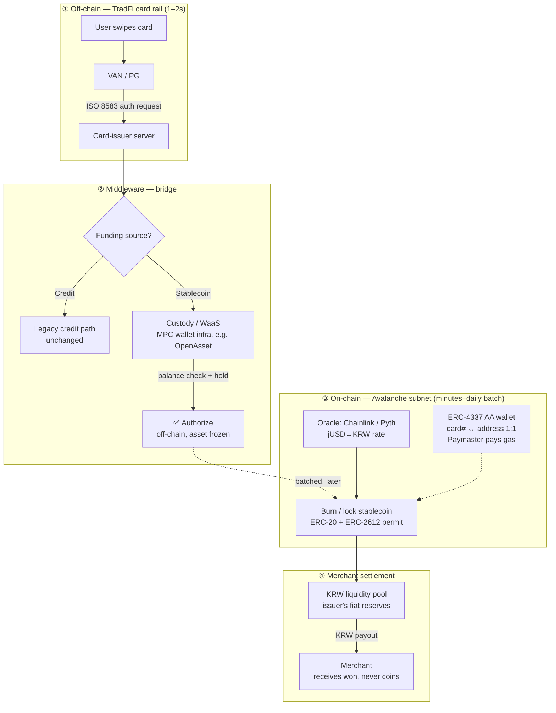
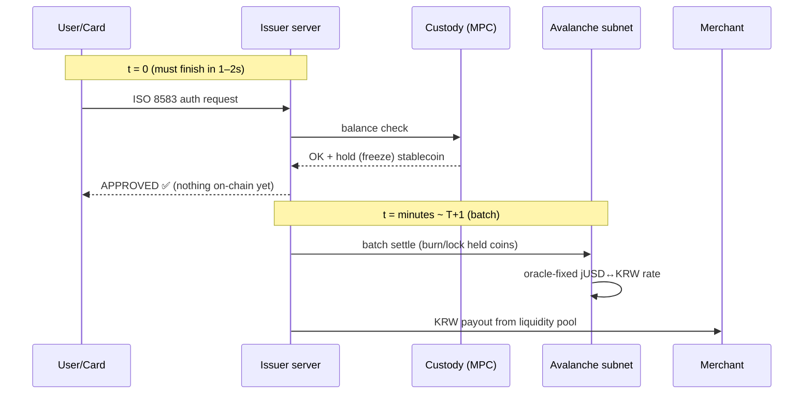

# KB Hybrid Card × Stablecoin Payment — Flow Map (reference)

**Scope: flow map only** (jay, 2026-07-17) — a reference diagram of how a TradFi card rail
(ISO 8583) combines with on-chain settlement (Avalanche subnet + stablecoin), modeled on
KB국민카드's reported design. **Not a dev item** — no PoC ladder; kept for architecture
reference and future tie-ins.

*Source: analysis note pasted in session 2026-07-17 (no URL — this doc is the canonical copy).*

## The four layers at a glance

## Timing split — the core trick (authorize now, settle later)

Card auth must return in 1–2s; chain finality can't. So **authorization is purely off-chain**
(hold on the custody balance) and the **on-chain movement is deferred batch settlement** —
the same authorize/settle split card networks already use, with the settle leg on-chain.

## Why each piece (one line each)
- **Avalanche subnet (Evergreen)** — an issuer-dedicated lane: public-chain security with
  gas-free config and KYC'd validators; Solidity carries over unchanged.
- **ERC-2612 permit + ERC-4337/Paymaster** — end users never see gas or seed phrases; card
  number ↔ wallet address is 1:1, issuer sponsors gas.
- **MPC custody** — no single private key to leak (same pillar as [dsrv-portal.md](dsrv-portal.md) ①).
- **Oracle (Chainlink/Pyth)** — fixes the jUSD↔KRW rate per settlement batch to bound FX drift.
- **KRW liquidity pool** — merchants want won, not coins; the pool fronts fiat while the
  stablecoin leg settles.

## Tie-ins (future, not scheduled)
- **AP2/x402 track** ([ap2-test.md](ap2-test.md)): the source note's closing idea — *agent
  earns stablecoin → spends it via a real card* — is exactly the aiaas wallet with this flow
  map as its off-ramp.
- **[agentic-aa.md](agentic-aa.md)**: pillar 2 (paymaster) and pillar 1 (scoped keys) are the
  same building blocks this design assumes.
- **[dsrv-portal.md](dsrv-portal.md)**: MPC custody + compliance pipeline are shared pillars.

## Status
Reference only — flow map, not a dev item.
