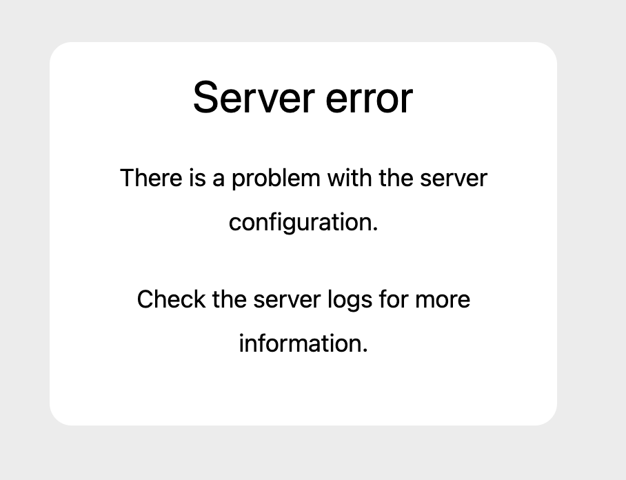

# Today's tasks for Rabbit project
17th June 2026

## Tasks

### Change the web page icon
- Use this for the web page icon: /Users/jay/work/task/images/profile.jpg

### WebGL game page
- https://messenger.abeto.co/ : this is the reference game
- I don't want a great web game just a sample game like that if you can 
- A user can enter the game through some top menu whose name you can determin

### Google Login Error
- When I try to login as google account this error happend: 

### Create a some feature design for Agentic Commerce
- You can add the file to this folder: /Users/jay/work/task/rabbit/docs/tasks
- This is some imaginatory description a feature using Agentic commerce using M2M, or AP2 or X402

