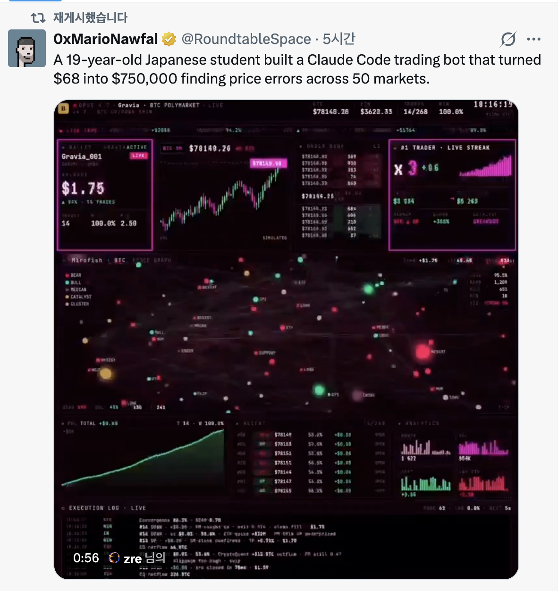

# Rabbit — Jul 01 Task

- **Related design:** [current-plan.md](current-plan.md)
- **Status:** task (feature description + carried-over design)


> Full content of [current-plan.md](current-plan.md), included for reference.

- **Source task file:** [jun-30-rabbit.md](jun-30-rabbit.md) · **IA:** [../features/README.md](../features/README.md)
- **Status:** design (for review)

## New First
✅ **DONE** — C4 관찰자 대시보드 + C2 서처(번들 제출)를 `/xyz`에 구현. 설계·구현: [../features/xyz-demo.md](../features/xyz-demo.md) · [../features/c2-searcher.md](../features/c2-searcher.md)

### Feature description — PBS consumer track (relay/builder 소비자)

좋은 방향 전환이야 — relay·builder를 *직접 만드는* 대신 **이미 돌아가는 relay/builder 인프라를 *소비*하는* 쪽. 이게 사실 현실 개발자가 PBS와 만나는 진짜 접점이야. 어디서 실제로 테스트 가능한지(테스트넷 relay 가용성) 먼저 확인하고 정리할게.

좋아, "이미 있는 relay를 쓴다" = **네가 인프라를 만드는 게 아니라 *소비자*가 되는 것**이야. 그럼 relay/builder를 만들 필요도, validator를 빌릴 필요도 없어 — 이미 돌아가는 Flashbots 인프라에 **너의 트랜잭션/번들을 밀어넣거나, 그 데이터를 읽는** 쪽이지. 네가 맡을 수 있는 역할이 4가지야:

#### 네가 될 수 있는 4가지 소비자 역할

| 트랙 | 역할 | 뭘 만드나 | 필요한 것 | 어디서 테스트 |
|---|---|---|---|---|
| **C4** ⭐첫걸음 | **관찰자** | relay Data API 읽어 분석/대시보드 | 아무것도(키 불필요) | 즉시(메인넷/Sepolia) |
| **C2** ⭐핵심 | **서처(searcher)** | 번들 만들어 `eth_sendBundle`로 제출 | 지갑·RPC | Sepolia |
| **C1** | **일반 발신자** | Protect RPC로 프라이빗 tx | 지갑 | Sepolia |
| **C3** | **검증자(제안자)** | mev-boost를 실제 relay에 연결·관찰 | validator 운영 | 테스트넷 validator |

"**relay를 사용**"의 알맹이는 **C2(서처)** 야 — 네 번들을 진짜 relay/builder에 넣어서 실제 블록에 포함시키는 것. C4로 감을 잡고 → C2로 직접 써보는 순서를 추천해.

#### 테스트넷 상황 (중요)

- Flashbots Protect/번들은 **메인넷 + Sepolia + Holesky** 지원인데, **Holesky는 폐기(2025-09)** 됐어. 그래서 **실질적으로 Sepolia가 유일한 테스트 경로**야. (Sepolia도 2026년 중 단계적 종료 예정이니, 시작 전에 [Flashbots 문서의 지원 네트워크]를 한 번 확인해.)
- Hoodi는 (검색 기준) 아직 Flashbots relay 지원이 확인 안 돼 — validator 실험(C3)용이지 번들(C2)용은 아님.

#### C4 — 관찰자 (지금 당장, 키도 필요 없음)

공개 relay Data API를 때려서 "누가 블록을 만들었나, 입찰가는 얼마였나"를 읽어:

```bash
# 최근 제안된 블록들(어느 builder/relay가 이겼는지, value 포함)
curl "https://boost-relay.flashbots.net/relay/v1/data/bidtraces/proposer_payload_delivered?limit=20"
# 특정 슬롯에 들어온 모든 입찰(경매 경쟁 관찰)
curl "https://boost-relay.flashbots.net/relay/v1/data/bidtraces/builder_blocks_received?slot=SLOT"
```

**샘플 프로그램:** 여러 relay(flashbots, bloxroute, agnostic…)를 동시에 폴링해서 **builder 시장점유율·입찰가 분포·relay별 지연**을 집계하는 작은 대시보드. `relayscan`(flashbots/relayscan)이 정확히 이걸 하는 오픈소스라 참고용으로 좋아. PBS "경매"가 실제로 어떻게 도는지 데이터로 체감돼.

#### C2 — 서처: 번들을 기존 relay에 제출 (핵심)

Sepolia에서 `flashbots/ethers-provider-flashbots-bundle`로 번들 한 개 보내보기:

```js
import { FlashbotsBundleProvider } from "@flashbots/ethers-provider-bundle";
import { ethers } from "ethers";

const provider = new ethers.JsonRpcProvider(SEPOLIA_RPC);
const auth = ethers.Wallet.createRandom();          // 서명자(평판용 키)
const fb = await FlashbotsBundleProvider.create(
  provider, auth, "https://relay-sepolia.flashbots.net", "sepolia");

const wallet = new ethers.Wallet(PRIVKEY, provider);
const target = await provider.getBlockNumber() + 1;

// 번들 = 순서 정해진 tx 묶음 (원자적: 다 들어가거나 다 빠지거나)
const bundle = [{ signer: wallet, transaction: {
  chainId: 11155111, to: "0x...", value: 0n, gasLimit: 21000,
  maxFeePerGas: ethers.parseUnits("30","gwei"),
  maxPriorityFeePerGas: ethers.parseUnits("2","gwei"),
}}];

const signed = await fb.signBundle(bundle);
const sim = await fb.simulate(signed, target);      // ← 먼저 시뮬(중요)
console.log("sim:", sim);
const res = await fb.sendRawBundle(signed, target); // ← 기존 relay에 제출
console.log("bundleHash:", res.bundleHash);
// res.wait() 로 포함 여부 확인
```

**샘플 프로그램 아이디어(진짜 "PBS를 쓴다"에 가까운 것):**
1. **원자적 멀티-tx**: "approve → swap"을 한 번에(둘 다 되거나 둘 다 안 되거나) — 번들의 원자성 체감.
2. **backrun 봇**: 특정 pending tx 뒤에 내 tx를 붙이는 번들(`mev_sendBundle` + MEV-Share 힌트) — 서처의 본질.
3. **프론트런 방지 실증**: 같은 스왑을 (a) 공개 mempool, (b) Protect RPC로 각각 보내 결과(샌드위치 유무) 비교 — 우리가 며칠 얘기한 그 지점.

#### C1 — 일반 발신자 (제일 간단)

번들도 필요 없이, **RPC만 바꿔** 프라이빗 발송:

```js
// RPC를 Protect로 바꾸면 그 지갑의 tx가 기존 builder로 프라이빗 전달
const provider = new ethers.JsonRpcProvider("https://rpc-sepolia.flashbots.net");
// 이후 일반 sendTransaction — mempool 안 거침
```

#### C3 — 검증자 쪽에서 기존 relay 쓰기 (무겁지만 "제안자 체험")

Hoodi(개방형 validator)에 검증자 하나 세우고 **mev-boost를 여러 실제 relay에 연결**:

```bash
mev-boost -mainnet=false \
  -relay https://0x...@boost-relay.flashbots.net \
  -relay https://0x...@bloxroute.relay... \
  -addr :18550
# CL 검증자 클라이언트의 --builder=http://localhost:18550
```

→ 네 블록이 *실제 builder들의 경매*로 채워지는 걸 mev-boost 로그로 관찰. "relay를 소비하는 제안자" 경험.

#### 추천 경로

**C4(데이터로 이해) → C2(번들로 직접 사용, Sepolia) → 필요하면 C3.** C1은 C2 하다 보면 자연히 익혀져.

---

원하면 **C4+C2 스타터 레포**를 스캐폴딩해줄게 — `pbs-consumer/`에 (1) `relaywatch/` 여러 relay Data API 폴링→builder 점유율 집계(Node/TS), (2) `bundler/` Sepolia 번들 제출 3시나리오(원자 멀티-tx·backrun·공개vs프라이빗 비교), (3) `.env.example`·README(Sepolia 세팅·faucet 링크). 만들어줄까? 이건 도커도 validator도 필요 없어서 바로 `npm run`으로 굴러가.

Sources: [Flashbots Protect Quick Start](https://docs.flashbots.net/flashbots-protect/quick-start) · [Sending Tx & Bundles](https://docs.flashbots.net/guide-send-tx-bundle) · [Relay API 스펙](https://flashbots.github.io/relay-specs/) · [ethers-provider-flashbots-bundle](https://github.com/flashbots/ethers-provider-flashbots-bundle) · [Hoodi/Holesky 상태](https://blog.ethereum.org/2025/03/18/hoodi-holesky)

#### 관련 논의 (Related discussion)
- [Laura Shin / Unchained — 스테이블코인 동결 & freeze 프론트런](https://x.com/laurashin/status/2072006037151052135) — freeze 트랜잭션이 공개 mempool에서 프론트런당하는 실제 사례. 프라이빗 릴레이(Flashbots Protect/빌더 직결)로 pending 노출을 없애 순서 경주를 막는 게 해법 — 이 문서 C1/C2 트랙과 직접 연결됨.

---

## New Second
### Task description

I want to have this kind of 쩌는 app in ETC category. Just similar web app that don't need to particular features.

### Claude design

**What jay wants (my read):** a visually striking, "쩌는" live-trading **dashboard** like the *Gravia*
screenshot — a showcase piece under **JayVerse** (the renamed ETC menu). **Not** a real trading bot: no profit logic, no live
capital. We reproduce the *look and motion* with mock (optionally real-public) data. The screenshot
itself is labeled `SIMULATED`, so we stay honest and do the same.

**Reality check on the source:** the tweet's "$68 → $750,000 across 50 markets" is unverified
marketing. We copy the **aesthetic + UX**, not the claim. Label the page `SIMULATED / DEMO` clearly.

#### Concept
A single, self-contained page at **`/etc/gravia`** (working name) — pure client-side, dark cyberpunk
terminal aesthetic: neon magenta/green on near-black, monospace, a tight grid of glowing panels,
subtle scanline/CRT glow, everything animating in real time off one mock feed.

#### Panels (mirror the screenshot)
1. **Top ticker bar** — model tag, market name, BTC/ETH prices, trade count, uptime clock.
2. **Wallet panel** — balance, win-rate, trade count (animated counters).
3. **Live candlestick chart** — BTC 5m, streaming candles.
4. **Order book ladder** — bids/asks with size bars.
5. **#1 Trader · Live Streak** — multiplier + sparkline.
6. **Market force-graph** — the signature centerpiece: bear/bull/median/catalyst/cluster nodes on a
   physics-driven network, pulsing. (Hardest panel.)
7. **P&L cumulative curve** — the "up and to the right" line.
8. **Recent trades table** — streaming rows.
9. **Analytics bars** — volume/heat mini bar charts.
10. **Execution log** — bottom terminal log, new lines appended live.

#### Tech (all client-side, no backend → matches "no particular features")
- **Charts:** `lightweight-charts` (TradingView) for candles + P&L line — tiny, canvas, fast.
- **Force graph:** `react-force-graph-2d` or raw `d3-force` on a canvas.
- **Data:** one **mock feed** — a seeded pseudo-random walk on `requestAnimationFrame`/`setInterval`
  driving every panel. Deterministic seed → looks alive but reproducible (and SSR-safe).
- **Styling:** Tailwind (already in the app) + a monospace font + CSS glow/scanline. No new heavy deps
  beyond the two chart libs.
- **State:** a single `useGravia()` hook holds the simulated world; panels subscribe.

#### Optional "make it real" tie-ins (later, not MVP)
This same doc already carries real public feeds — we can swap mock → real for two panels:
- **Hyperliquid orderbook** (§3) → drive the real L2 book panel.
- **Flashbots relay Data API** (New First / PBS section) → a "builder auction" panel showing real
  winning bids. That turns the JayVerse page into a genuine **PBS/MEV live board**, not just eye-candy —
  a strong differentiator and a real tie to the rest of Rabbit.

#### Scope / recommendation
- **MVP (build first):** all panels, **100% mock** animated feed, one route, no auth, no persistence.
  Fast, high "wow", zero infra — exactly the "don't need particular features" ask.
- **v2:** wire the Hyperliquid book + relay Data API into two panels for authenticity.
- Keep it **clearly labeled SIMULATED** with a one-line "what this is / isn't" note, so nobody mistakes
  it for a real trading product.

#### Open questions for jay
1. Route name — `/etc/gravia`, or a neutral one like `/etc/trading-terminal`?
2. MVP fully mock, or wire the real Hyperliquid book from day one?
3. Is the **force-graph** centerpiece a must-have for MVP (it's the most work), or defer to v2?

---

## New Third
✅ **DONE**
- Compile docs/features/etc.md into docs/features/xyz-demo.md
- Change the name ETC to JayVerse that contains the eye-popping features describe in New Second

**Done (2026-07-01):**
- `etc.md`'s misc experiments (SimpleX Chat test) folded into
  [../features/xyz-demo.md](../features/xyz-demo.md) under a new "Misc experiments (absorbed from
  ETC)" section.
- **ETC → JayVerse:** `docs/features/etc.md` renamed (`git mv`) to
  [../features/jayverse.md](../features/jayverse.md) and rewritten as the JayVerse showcase category
  (`/jayverse`), holding the eye-popping Gravia live-trading dashboard from **New Second**.
- IA table in [../features/README.md](../features/README.md) updated: `ETC | /etc | etc.md` →
  `JayVerse | /jayverse | jayverse.md`.

---
## New Fourth
✅ **DONE**
- Please Add the button to change English mode and Korean mode besides "Dard/Light" mode button
- This can be another commit.

**Done (2026-07-01):** Added an **EN/KO language toggle** button next to the theme toggle in
`app/Nav.tsx`. New `app/LangContext.tsx` (client, localStorage-persisted), `app/LangToggle.tsx`
(the button), `app/NavLinks.tsx` (menu labels switch ko/en); `app/layout.tsx` wraps the app in
`LangProvider` and sets `<html lang>` before paint (no flash). First cut translates the top-menu
labels; page content can follow incrementally. Committed separately.

--- 
## 0. Summary
Designs for the Jun 30 tasks: split **Portfolio & Market** into two categories + reorder the menu,
refine **auth / LLM gating**, build the **Market** page (Hyperliquid orderbook + indices), fix the
**Knowledge** page (serve `know.html`), add **KB-over-MCP/RAG** to AI Chat, an **AP2 Stripe**
settlement example, and an **ETC ERC-7702 / 7715** demo.

## 1. Split "Portfolio & Market" → Portfolio + Market
✅ **DONE**
**Now:** one item *Portfolio & Market* (`/portfolio`, stub). **Target:** two categories.
- **Portfolio** → `/portfolio` — holdings, P&L (**login-only**).
- **Market** → `/market` (new) — market data (indices + Hyperliquid orderbook, §3).

**New menu order:** `Knowledge · Portfolio · AI Chat · Game · Market · AP2 · XYZ · JayVerse`.
**Decided (jay):** **Home = `/`** (logo/profile entry, leads the bar) and **Verex = trailing
external link** after JayVerse. Full bar:
`Home · Knowledge · Portfolio · AI Chat · Game · Market · AP2 · XYZ · JayVerse · Verex ↗`.
**Work:** edit `app/Nav.tsx` MENU; create `/market`; move market widgets out of `/summary`; keep
`/portfolio` for holdings.
**✅ Done (2026-06-30):** `Nav.tsx` split + reordered; `/market` page added (stub — indices/orderbook
content is §3 / task 3); `/market` public + `/portfolio` still login-only in `middleware.ts`.
Verified on build + server (`/market` 200, `/portfolio` 302→/login).
**(2026-06-30 update: Knowledge category later removed from the menu — see §4; current bar omits 지식.)**

## 2. Auth + LLM gating
🔲 **TODO**
- **Login-only category:** **Portfolio** — its **menu item is hidden until login** (`authOnly` in
  `Nav.tsx`) **and** access-gated in `middleware.ts`. (AI Chat: menu stays visible, access-gated.)
- **AI Chat access model:**
  - To chat, the user selects a **Proprietary LLM** and supplies **their own API key**.
  - **Local LLM** works **only when the app runs on the local machine** (local mode — Ollama
    reachable at `localhost`). On the **cloud deployment** it's **shown but disabled** (no hosted OSS
    model provisioned yet) → selecting it there shows "not available in cloud yet".
  - **jay (`linked0@gmail.com`)** uses the **server-stored API key** for the proprietary LLM (no paste).
- **Design:** `lib/ai.ts` already abstracts providers. Add a key/source resolver:
  `jay → env secret` · `other user → own key, persisted per user, **encrypted at rest**` ·
  `Local LLM → enabled in local mode (Ollama at localhost), disabled in cloud`.
  Gate the stored-key path on `session.user.email === linked0@gmail.com`; detect mode via `appMode()`
  (`lib/mode.ts`) so the Local LLM option is live locally and inert in cloud.
- **Decided (jay):** **persist** users' keys — **encrypted at rest** (encryption key in env, never
  plaintext; a `userApiKey` field keyed by user). Proprietary provider = **current setting (OpenAI)**;
  add Anthropic later if wanted.

## 3. Market page — Hyperliquid orderbook + indices
🔲 **TODO**
- New `/market` shows:
  - **Important indices** — reuse `/summary`'s `IndexCards` (BTC · ETH · S&P 500 · KOSPI).
  - **Hyperliquid orderbook** — live L2 (bids/asks, maybe funding) for a chosen market. Reuse
    `app/api/perp` / `app/api/indices` if they fit, else add `app/api/orderbook` proxying
    Hyperliquid's public info endpoint.
- **Design:** server route proxies the Hyperliquid REST snapshot (or a WS client streams to the
  page); render a compact L2 book above the index cards. Public API → no key.
- **Decided (jay):** **REST poll first**, add **WebSocket** in a later step. Default market =
  **BTC perp** (most liquid) for the first cut.

## 4. Knowledge page — serve `know.html` (Fix: No content)
✅ **DONE**
**↺ Superseded (2026-06-30) — Knowledge category removed (restore when needed).** Per jay: the
Knowledge menu item + `/knowledge` route were **removed** from the app; its content now lives in
**`docs/`** for **local `file://` browsing** (not web-served → no public exposure):
`docs/know.html` (index, opened via `file:///Users/jay/work/task/docs/know.html`) + `docs/knowledge/`
(e.g. `management.md`). The web-iframe approach below is on hold. *Open:* know.html links to
`ai/`/`eng/`/`nostra/` (in `archive/`, 881 MB) + `docs/*` — not relocated; left for the restore step.
- **Now:** `/knowledge` is a stub; `know.html` sits **loose at the repo root** (plus a copy in `public/`).
- **Target:** `/knowledge` renders `know.html`; move the loose root content files into a proper home.
- **Decided (jay):** serve **`know.html` as the main content (iframe, no React port)**; gather the
  files it references and move the whole set into **`public/knowledge/`**.
- **Design:** move `know.html` + its linked files (e.g. `management.md`, any images it points to)
  into `public/knowledge/`; `/knowledge` embeds `public/knowledge/know.html` in an iframe. (Scan
  `know.html` for `href`/`src` to find the exact related-file set.)
- **✅ Done (2026-06-30):** moved `know.html` + `management.md` → `public/knowledge/`; `/knowledge`
  iframes `/knowledge/know.html`; `middleware.ts` matcher excludes `knowledge/` so the static file
  serves without auth. Verified (200 + "Workspace Index" content).
- **Loose root files → `docs/archive/`** ✅ (2026-06-30): moved the leftover study files
  (`index.html`, `baseline_*.html`, `management.html`, `sarah_chen_index.html`, `luminary_index.html`,
  `zksnark_math.html`, `assumptions.md`, `clarifying_questions.md`) into `docs/archive/` for later
  reference. `README.md` (project setup) stays at root.
- **know.html links — recommend PRUNE** (not fix). The app web-serves only `public/`, so its links to
  `ai/`/`eng/`/`nostra/`/`images/`/`docs/` (repo files now in `archive/`/`docs/`) would **still 404**
  even if the paths were corrected. Plan: **fix** the one served link (`management.md` →
  `/knowledge/management.md`) and **neutralize the rest** (strip dead local `href`s, keep the text).
  Pending jay's go-ahead.

## 5. AI Chat — KB via MCP + RAG
🔲 **TODO**
- **Goal:** chat can query the **Knowledge KB** using **RAG**, exposed through an **MCP** tool.
- **Decided (jay):** the MCP exposes **KB search / retrieval** (settles the earlier TBD; see
  `../features/ai-chat.md`).
- **Design:**
  - Index Knowledge content (`know.html` + md) → embeddings → vector store (local Chroma/Qdrant, or
    a simple file index to start).
  - Expose retrieval as **this project's MCP server**; the chat agent calls it as a tool. (Fallback:
    do RAG directly in `/api/chat` and keep MCP for tool-calling.)
  - Flow: question → retrieve top-k chunks → inject into prompt → LLM answers **with citations**.
- **Open:** embedding model (local `nomic-embed` vs OpenAI), vector store, MCP-tool vs in-route RAG.

## 6. AP2 — Stripe settlement example (educational)
🔲 **TODO**
- **Goal:** a simple, educational **fiat** settlement example via **Stripe** (counterpart to the
  on-chain x402 / aiaas track in `../features/ap2-test.md`).
- **Design:** mock "agent buys data, settles via Stripe":
  provider returns a price → client creates a **Stripe Checkout / PaymentIntent** → on success the
  data is released. **Test-mode keys only**, no real charges.
- **Open:** Checkout vs PaymentIntent; how prominently to contrast it with x402.

## 7. ETC — ERC-7702 / 7715 demo (educational)
🔲 **TODO**
**Standards (jay confirmed):** **EIP-7702** (an EOA temporarily runs smart-account code = a
*delegatable smart account*) + **ERC-7715** (`wallet_grantPermissions` — grant a scoped **session
key**) / **ERC-7710** (delegation).
- **Goal:** a test page for **delegatable smart accounts / session keys** — ties directly to the
  aiaas spend-policy idea (session key = agent's bounded wallet).
- **Design (educational):**
  - Connect a wallet → **grant a session key** with a scoped permission ("spend ≤ X testnet jUSD to
    address Y, valid 1h") per **ERC-7715** → show the session key performing that **bounded action
    without re-signing**.
  - Testnet (**Sepolia**) + a 7702-capable account; display the permission grant + one delegated tx.
- **Decided (jay):** stack = **MetaMask Delegation Toolkit** (implements 7715/7710) on **Sepolia**.
  *(Alternative: ZeroDev / permissionless.js for 7702/4337 session keys.)* Scope = short explainer + one demo tx.

## 8. Cross-cutting — IA update
🔲 **TODO**
- Update the Target IA table in `../features/README.md`: split Portfolio & Market, add **Market**,
  apply the new order.
- New/changed routes: `/market`; Knowledge content move + serve; `/etc` ERC demo subpage; AP2 Stripe
  example under `/ap2`.

## 9. Decisions & remaining open questions
**Resolved (jay):**
- Home = `/` (logo) · Verex = trailing external link.
- AI Chat keys: **persist per user, encrypted at rest**; proprietary provider = **OpenAI** now (Anthropic later — easy add).
- Market: **REST poll first**, WebSocket next; default market **BTC perp**.
- Knowledge: serve **`know.html`** as-is (iframe) + move it and its linked files into **`public/knowledge/`**.
- MCP exposes **KB retrieval**.
- ETC standards = **7702 + 7715/7710**; stack = **MetaMask Delegation Toolkit on Sepolia**.

**Still open:**
- KB: embedding model (local `nomic-embed` vs OpenAI) + vector store; MCP-tool vs in-route RAG.
- AP2: Stripe Checkout vs PaymentIntent.

## 10. Suggested sequence
1. Menu split + reorder + **Market** page (indices first, orderbook next).
2. **Knowledge** content move + serve `know.html`.
3. **AI Chat** gating (BYO key / jay's stored key; local disabled).
4. **KB RAG + MCP**.
5. **AP2 Stripe** example; **ETC ERC-7702/7715** demo.
