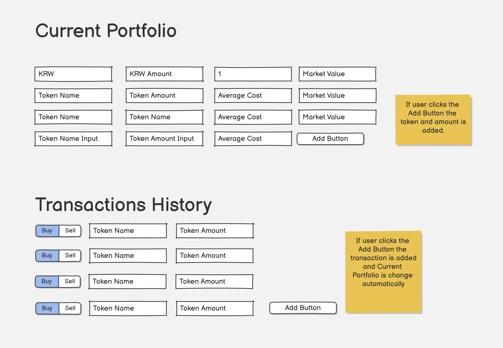

# Tasks for Rabbit in 19th June

## Overview
You can create a jun-19-rabbit-design.md file.

You already did the great thing to implemented as we planed. I want you to do the main items as describe as follows.

## Tasks

### Portfolio & Market category

#### Input and Current Status 
- It provides a input page for the user's trades for tracking the investment action.
- It should be stored in database that I chose Postgresql for that
- This task also provide how to set Database instance in GCP.

#### Simulate results based on the investment policy
- There are so many method to gain a profit or loss in investment. There are many setting for investigation that I will provide an UX that you should ask me if I don't provide you.
- You can add anything you think would be great. I will refine the UI later

#### Hyperliquid 
- Make a user to trade Ethereum Perp UI through API
- This occupy some portion of Portfolio & Market category

### AI Chat

#### MCP support
- The AI chat page connect with a simple MCP server of which code will be located in /Users/jay/work/task/rabbit/spagetties that is for providing Spagetti recipies that will be recommended by Claude
- The UI has some switch button to set on/off the MCP server

### New Site
- Create `home` directory in root of task repo that is main web site of jaylabs.xyz domain, which is www.jaylabs.xyz.
- The home page has a link to verex.jaylabs.xyz
- Fetch the content of https://linked0.github.io/ and add it to the home page also subpages.

### Deploy into GCP
- Show me how to set for Rabbit project in the domain. You can recommend an URL for this project.
- I already purchased a domain named jaylabs.xyz we can create a web site with this domain.
